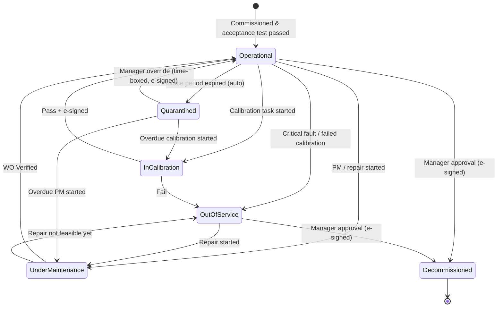
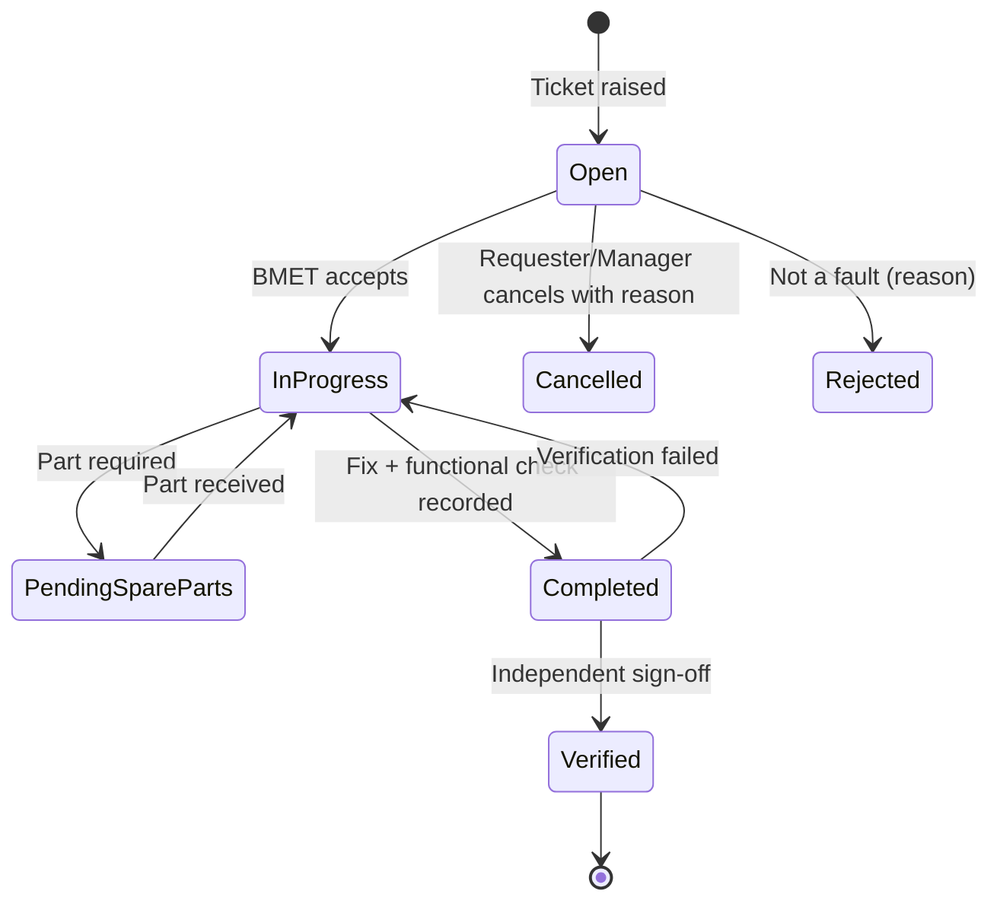
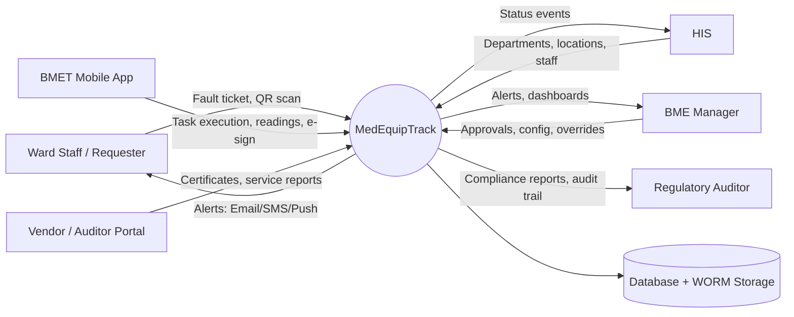
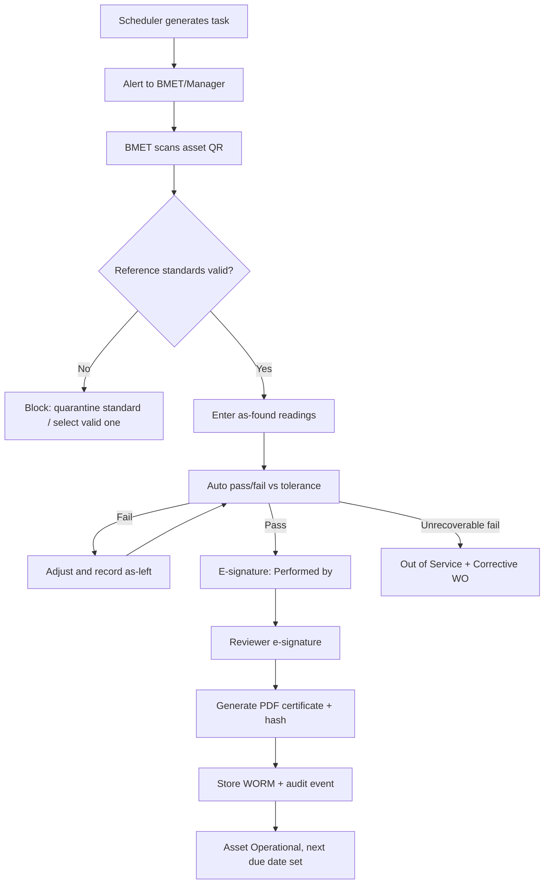
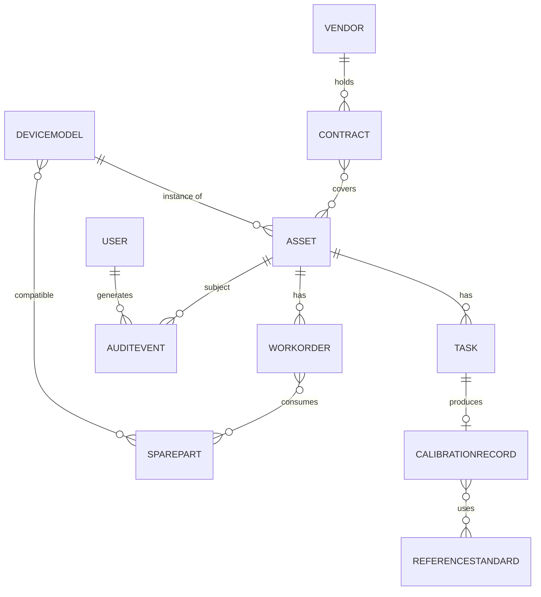

MedEquipTrack SRS v1.0

[1. Introduction](#1-introduction) [2. Overall Description](#2-overall-description) [3. System Features and Functional Requirements](#3-system-features-and-functional-requirements) [4. External Interface Requirements](#4-external-interface-requirements) [5. Non-Functional Requirements](#5-non-functional-requirements) [6. Data Requirements & Security Constraints](#6-data-requirements-security-constraints) [7. System Models & Data Flow](#7-system-models-data-flow) [8. Appendices & Regulatory Guidelines](#8-appendices-regulatory-guidelines)

# Software Requirements Specification (SRS) [#](#software-requirements-specification-srs)

## MedEquipTrack: Medical Equipment Maintenance & Calibration Tracking System [#](#medequiptrack-medical-equipment-maintenance-calibration-tracking-system)

### Document Header [#](#document-header)

| Field | Value |
| --- | --- |
| **Document Title** | MedEquipTrack SRS |
| **Document Version** | 1.0 (Draft) |
| **Date** | 28 September 2026 |
| **Prepared By** | Lead Engineer / Biomedical Systems Team |
| **Standard Followed** | IEEE 830 / ISO/IEC/IEEE 29148 (adapted) |
| **Status** | Draft for Technical & Regulatory Review |
| **Compliance Verification Required** | FDA 21 CFR Part 11; ISO 13485; ISO/IEC 17025 |

> **Regulatory note.** Hospitals are generally not device manufacturers, so 21 CFR Part 11 does not automatically bind them. MedEquipTrack is nevertheless designed to Part 11 controls (audit trails, electronic signatures, record integrity) so that its records are defensible in FDA-facing, NABH, JCI and ISO audits. Regulatory Affairs must confirm the applicable scope per deployment jurisdiction before validation.

## Table of Contents

1. [1. Introduction](#1-introduction)
2. [2. Overall Description](#2-overall-description)
3. [3. System Features and Functional Requirements](#3-system-features-and-functional-requirements)
4. [4. External Interface Requirements](#4-external-interface-requirements)
5. [5. Non-Functional Requirements](#5-non-functional-requirements)
6. [6. Data Requirements & Security Constraints](#6-data-requirements-security-constraints)
7. [7. System Models & Data Flow](#7-system-models-data-flow)
8. [8. Appendices & Regulatory Guidelines](#8-appendices-regulatory-guidelines)

---

## 1. Introduction [#](#1-introduction)

### 1.1 Purpose [#](#1-1-purpose)

This SRS defines the functional, non-functional, interface, data and security requirements of **MedEquipTrack**, a cloud-hosted platform for tracking, maintaining, calibrating and auditing medical devices (ventilators, defibrillators, patient monitors, ECG machines, infusion pumps and comparable equipment).

**Intended audience and usage**

| Audience | Use of this document |
| --- | --- |
| Biomedical Engineers / BME Managers | Validate that workflows match departmental practice |
| Hospital Administrators | Confirm scope, compliance outcomes, and cost/risk alignment |
| Biomedical Equipment Technicians (BMETs) | Confirm mobile and field-workflow requirements |
| Regulatory Auditors / Quality Assurance | Verify traceability, audit-trail and e-signature controls |
| Software Architects, Developers, QA/Validation | Basis for design, implementation, test and IQ/OQ/PQ protocols |

### 1.2 Problem Statement [#](#1-2-problem-statement)

Healthcare facilities operate thousands of devices across dozens of departments, commonly managed through spreadsheets, paper logbooks or generic CMMS tools. This produces recurring, patient-safety-relevant failures:

| # | Problem | Consequence |
| --- | --- | --- |
| P1 | Uncalibrated or out-of-tolerance devices remain in clinical use | Diagnostic and dosing errors (e.g., infusion pump flow drift, monitor SpO₂/NIBP inaccuracy) |
| P2 | Preventive maintenance (PM) schedules missed or untracked | Higher failure rates, shorter device life, elevated MTBF risk |
| P3 | Equipment location and status unknown | Time lost searching for devices during emergencies; hoarding and idle assets |
| P4 | Records incomplete, unsigned or alterable | Non-conformities during NABH, JCI, ISO 13485 or regulatory audits |
| P5 | Unexpected downtime during surgeries or emergencies | Procedure delays, patient harm, revenue loss |
| P6 | Reference standards used by technicians are themselves out of calibration | Invalid calibration results and broken traceability chain |
| P7 | AMC/CMC contracts and warranties lapse unnoticed | Avoidable repair cost and vendor SLA disputes |

MedEquipTrack addresses P1–P7 through automated scheduling, enforced quarantine of non-compliant devices, digital signed records and immutable audit logging.

### 1.3 Scope [#](#1-3-scope)

**In Scope (v1.0)** - Asset lifecycle management (acquisition record through decommissioning) - Automated PM and calibration scheduling with alerts - QR/RFID tag generation and lookup - Breakdown work order (WO) ticketing - Calibration execution, e-signature and certificate generation - Spare parts inventory linked to device models - Vendor and service contract (AMC/CMC) management - Audit trail, compliance reporting and dashboards - HIS integration for department/location master data

**Out of Scope (v1.0)** - Real-time telemetry or automated reading of diagnostic/clinical data from devices - Automated purchasing and procurement of capital equipment - Mapping of devices to patient EHR records or clinical diagnoses - Clinical decision support - Financial accounting and depreciation ledgers (export only)

### 1.4 Definitions, Acronyms, and Abbreviations [#](#1-4-definitions-acronyms-and-abbreviations)

| Term | Definition |
| --- | --- |
| **AMC** | Annual Maintenance Contract: vendor service agreement, typically labour-only or limited-parts |
| **BME** | Biomedical Engineering |
| **BMET** | Biomedical Equipment Technician |
| **Breakdown Maintenance** | Corrective maintenance performed after a fault or failure is reported |
| **Calibration** | Comparison of a device's measurements against a reference standard of higher accuracy, with documented deviation and correction |
| **CMC** | Comprehensive Maintenance Contract: vendor agreement including parts and labour |
| **CMMS** | Computerized Maintenance Management System |
| **DoW / RPO / RTO** | Disaster recovery metrics: Recovery Point Objective / Recovery Time Objective |
| **FDA 21 CFR Part 11** | US FDA regulation on electronic records and electronic signatures |
| **HIS** | Hospital Information System |
| **HL7 / FHIR** | Healthcare data exchange standards |
| **IQ/OQ/PQ** | Installation / Operational / Performance Qualification (software validation stages) |
| **ISO 13485** | Quality management systems for medical devices |
| **ISO/IEC 17025** | General requirements for competence of testing and calibration laboratories |
| **MTBF** | Mean Time Between Failures (repairable systems) |
| **MTTF** | Mean Time To Failure (non-repairable items) |
| **MTTR** | Mean Time To Repair |
| **NIST Traceability** | Unbroken chain of comparisons linking a measurement to national/international standards, each with stated uncertainty |
| **PM** | Preventive Maintenance |
| **Quarantine** | System state that blocks a device from clinical use until compliance is restored |
| **RBAC** | Role-Based Access Control |
| **SLA** | Service Level Agreement |
| **TUR/TAR** | Test Uncertainty/Accuracy Ratio between reference standard and unit under test |
| **UUT** | Unit Under Test |
| **WO** | Work Order |

### 1.5 References [#](#1-5-references)

| ID | Reference |
| --- | --- |
| REF-1 | IEEE Std 830-1998 / ISO/IEC/IEEE 29148:2018, Requirements Engineering |
| REF-2 | ISO 13485:2016, Medical devices, Quality management systems (notably cl. 6.3 Infrastructure/maintenance, 7.6 Control of monitoring and measuring equipment, 4.2.5 Control of records) |
| REF-3 | 21 CFR Part 11, Electronic Records; Electronic Signatures |
| REF-4 | ISO/IEC 17025:2017, Competence of testing and calibration laboratories (metrological traceability) |
| REF-5 | IEC 62353, Recurrent test and test after repair of medical electrical equipment |
| REF-6 | IEC 60601-1, Medical electrical equipment, general requirements for basic safety |
| REF-7 | NABH Accreditation Standards for Hospitals (facility management and safety chapters) |
| REF-8 | Joint Commission International (JCI) Accreditation Standards for Hospitals (Facility Management and Safety) |
| REF-9 | HIPAA Security Rule (45 CFR Part 164) and applicable local data-protection law |
| REF-10 | FDA guidance: *General Principles of Software Validation*; *Part 11 Scope and Application* |
| REF-11 | IEC 62304 (for software lifecycle discipline, applied by analogy) |
| REF-12 | OWASP ASVS 4.x |

### 1.6 Document Overview [#](#1-6-document-overview)

- **Section 2** describes the product context, users, environment, constraints and assumptions.
- **Section 3** specifies functional requirements per feature, each with unique ID, priority and acceptance criteria.
- **Section 4** defines user, hardware, software and communication interfaces.
- **Section 5** defines performance, security, reliability, maintainability and usability requirements.
- **Section 6** defines data structures, retention, integrity and security constraints.
- **Section 7** presents state, data-flow and entity models.
- **Section 8** provides a traceability matrix, regulatory mapping, and open issues.

**Requirement conventions:** "shall" = mandatory; "should" = recommended; "may" = optional. **Priority:** H = release-blocking, M = required for v1.0 unless deferred by change control, L = desirable.

---

## 2. Overall Description [#](#2-overall-description)

### 2.1 Product Perspective [#](#2-1-product-perspective)

MedEquipTrack is a standalone, multi-tenant, cloud-hosted web and mobile platform. It is not a medical device and performs no clinical function; it is a quality and maintenance record system.

```
                       +--------------------------------------+
  Web App (BME/Admin)  |           API Gateway (TLS 1.3)      |   HIS (REST / HL7 v2 / FHIR)
  Mobile App (BMET,    |   AuthN/AuthZ (OIDC, RBAC, MFA)      |<--------------------------->
  Nurse; offline-first)|--------------------------------------|
  Vendor Portal        |  Asset | Scheduler | WO | Calibration |   SMTP / SMS Gateway
        |              |  Inventory | Contracts | Reporting   |<--------------------------->
        v              |  Notification | Audit Log Service    |
  QR / RFID / Bluetooth|--------------------------------------|   Object Storage (PDF certs,
  scanners, label      |  PostgreSQL (primary) | Job Queue    |   photos, attachments; WORM)
  printers             |  Append-only Audit Store             |
                       +--------------------------------------+
```

### 2.2 Product Functions (Summary) [#](#2-2-product-functions-summary)

- **Asset onboarding:** register devices with digital passport, risk class, QR/RFID tag.
- **Automated scheduling:** risk-based PM and calibration calendars, alerts, grace periods, auto-quarantine.
- **Mobile technician app:** scan-to-open asset, task lists, offline work, photo capture.
- **Breakdown ticketing:** staff-raised faults, auto-assignment, SLA-tracked status flow.
- **Calibration verification:** digital forms with pass/fail evaluation, reference-standard validity checks, e-signature, certificate generation.
- **Spares and contracts:** inventory, low-stock alerts, AMC/CMC and warranty tracking.
- **Compliance reporting:** immutable audit trail and one-click audit reports (NABH, JCI, ISO, FDA).

### 2.3 User Classes and Characteristics [#](#2-3-user-classes-and-characteristics)

| User Class | Technical Skill | Frequency | Primary Interface | Key Needs |
| --- | --- | --- | --- | --- |
| **BMET** | High (technical), moderate (software) | Daily | Mobile app (often offline), web | Fast scan lookup, guided calibration forms, minimal typing, gloved/one-handed use |
| **BME Manager / Chief Engineer** | High | Daily | Web dashboard | Compliance rate, workload, overdue list, approval and sign-off, contract oversight |
| **Hospital Staff / Ward Nurse (Requester)** | Low | Occasional | Mobile / web / QR scan | Report fault in under 60 seconds, see ticket status, know if device is safe to use |
| **External Calibration Vendor / Auditor** | Moderate | Periodic | Restricted web portal | Time-boxed, scoped access; upload certificates; read-only audit evidence |
| **System Administrator** | High (IT) | As needed | Web admin console | User/role management, configuration, integrations, backup monitoring |

### 2.4 Operating Environment [#](#2-4-operating-environment)

- **Web:** current and previous major versions of Chrome, Edge, Firefox, Safari; responsive from 360 px width.
- **Mobile:** Android 10+ and iOS 15+; camera required for QR; Bluetooth 4.0+ for handheld scanners.
- **Network:** shall remain usable on 3G/4G and congested hospital Wi-Fi (baseline 1 Mbps, 300 ms RTT); full offline operation for field tasks.
- **Hosting:** containerized services on a major cloud provider, deployed in a region satisfying data-residency requirements; optional single-tenant/private deployment.
- **Time:** all timestamps stored in UTC (ISO 8601) and displayed in facility local time.

### 2.5 Design and Implementation Constraints [#](#2-5-design-and-implementation-constraints)

| ID | Constraint |
| --- | --- |
| DC-1 | Electronic signatures shall satisfy 21 CFR Part 11 Subpart C (unique to one individual, two-component authentication at signing, signature manifestation with printed name, date/time and meaning). |
| DC-2 | Audit logs shall be immutable, computer-generated, time-stamped, and retained at least as long as the underlying record (21 CFR 11.10(e)). |
| DC-3 | The system shall hold no patient-identifiable information (PII/PHI). Device-to-patient linkage is prohibited by design (Section 1.3); free-text fields shall be screened and warn on patterns resembling patient identifiers. |
| DC-4 | Calibration records shall carry a traceability chain to national/international standards (NIST or the national metrology institute, e.g., NPL India), including reference standard ID, certificate number, uncertainty and due date. |
| DC-5 | Software shall be validated (IQ/OQ/PQ) and shall support risk-based validation documentation. |
| DC-6 | All third-party components shall be inventoried (SBOM) and vulnerability-scanned. |
| DC-7 | Regional deployments shall support data residency and local language/locale settings. |

### 2.6 Assumptions and Dependencies [#](#2-6-assumptions-and-dependencies)

| ID | Assumption / Dependency | Impact if invalid |
| --- | --- | --- |
| A-1 | Every in-scope asset carries a durable QR code or RFID tag (or can be tagged at onboarding). | Scan workflows degrade to manual search; onboarding effort increases |
| A-2 | Calibration equipment used by technicians is itself validly certified, with certificates entered into the system. | Calibration results cannot be validated; system blocks sign-off (FR-4.3) |
| A-3 | Manufacturer service manuals and recommended intervals are available to the facility. | Intervals fall back to risk-based defaults, subject to BME Manager approval |
| A-4 | The hospital provides HIS API access or master-data exports for departments and locations. | Manual/CSV master data maintenance |
| A-5 | Users have institutional email; SMS gateway is contracted by the facility. | Alerts limited to in-app and email |
| A-6 | Facility maintains an identity provider (SAML/OIDC) or accepts platform-managed identity. | Local accounts with enforced MFA are used |
| A-7 | Regulatory Affairs determines the applicable regulatory scope per deployment. | Validation scope may change |

---

## 3. System Features and Functional Requirements [#](#3-system-features-and-functional-requirements)

*Each requirement has a unique ID, Priority (H/M/L), and testable acceptance criteria.*

### 3.1 Equipment Asset Management & Digital Passport [#](#3-1-equipment-asset-management-digital-passport)

| ID | Requirement | Pri | Acceptance Criteria |
| --- | --- | --- | --- |
| FR-1.1 | The system shall allow authorized users to register an asset with: asset ID (auto-generated), manufacturer, model, serial number, UDI (if available), department, location, purchase date, purchase cost, warranty start/end, vendor, and risk category. | H | Asset cannot be saved without mandatory fields; duplicate manufacturer+serial pair is rejected with a clear error. |
| FR-1.2 | The system shall assign a risk category (**Critical, High, Medium, Low**) to each asset, defaulted from the device-model template and overridable by a BME Manager with recorded justification. | H | Override requires a reason; change appears in audit log with old/new values. |
| FR-1.3 | The system shall generate a unique QR code per asset encoding a resolvable URL/asset ID, and shall support writing/associating an RFID tag ID. | H | Scanning the QR opens the correct asset passport; an RFID tag ID cannot be associated with two active assets. |
| FR-1.4 | The system shall print QR/RFID labels to supported label printers in configurable templates (size, logo, human-readable ID). | M | Label renders correctly on a reference printer at 300 dpi; batch printing of ≥ 100 labels succeeds. |
| FR-1.5 | The system shall maintain a **Digital Passport** per asset showing: identity, current status, location, risk class, PM/calibration history, open and closed WOs, spare parts consumed, contracts, attachments (manuals, photos), and lifetime cost. | H | All listed sections load on a single asset page; each history entry links to its source record. |
| FR-1.6 | The system shall support asset status values: **Operational, In Calibration, Out of Service, Under Maintenance, Decommissioned** (plus system-controlled **Quarantined**, see FR-2.6). | H | Only permitted transitions (Section 7.1) are accepted; invalid transitions return an error and are logged. |
| FR-1.7 | Status changes shall record actor, timestamp, reason, and linked WO or task, and shall be visible in the passport timeline. | H | 100% of status changes generate an audit entry with all four fields. |
| FR-1.8 | The system shall record asset location and transfers between departments/rooms, and support location update by scanning the asset then the location QR. | M | Transfer produces a dated location-history entry; asset search by location reflects the change within 5 seconds. |
| FR-1.9 | The system shall support bulk import of assets via CSV/XLSX with validation report and rollback on failure. | M | Import of 5,000 rows completes in under 5 minutes; invalid rows are reported with row number and reason; no partial commit unless user selects "import valid rows". |
| FR-1.10 | Decommissioning shall require BME Manager approval with e-signature, disposal method and date; decommissioned assets shall retain full history read-only and be excluded from schedules. | H | Scheduled tasks for the asset are cancelled; asset can no longer be selected in new WOs. |
| FR-1.11 | The system shall maintain a device-model library (templates) containing default risk class, PM/calibration procedures, intervals, checklists and compatible spare parts. | M | Creating an asset from a template pre-populates schedule and checklist. |
| FR-1.12 | The system shall display recalls/safety notices attached to a model and flag all affected assets by serial-number range. | L | Manager can create a notice; affected assets show a banner and appear in a filtered list. |

### 3.2 Automated Preventive Maintenance (PM) & Calibration Scheduler [#](#3-2-automated-preventive-maintenance-pm-calibration-scheduler)

| ID | Requirement | Pri | Acceptance Criteria |
| --- | --- | --- | --- |
| FR-2.1 | The system shall support configurable PM and calibration intervals per device model and per asset (e.g., monthly, quarterly, semi-annually, annually, or custom days), defaulting from manufacturer guidance and risk category. | H | Interval changes require manager approval and justification; changes apply to future tasks only and are audit-logged. |
| FR-2.2 | The system shall automatically generate future PM and calibration tasks on a rolling horizon (default 12 months) upon asset activation and after each task completion. | H | Completing a task creates the next due task computed from the configured basis (**completion date** or **fixed calendar date**). |
| FR-2.3 | The system shall provide a calendar view (day/week/month) and list view of scheduled tasks, filterable by department, risk class, technician, task type and status. | H | Filter combinations return results in under 2 seconds for 10,000 tasks. |
| FR-2.4 | The system shall send email, SMS and in-app alerts at configurable lead times (default 30, 14, 7 and 1 day before due date) to the assigned BMET and BME Manager. | H | Alerts sent within 5 minutes of trigger; delivery status recorded; failed deliveries are retried up to 3 times. |
| FR-2.5 | The system shall support a configurable **grace period** per risk category (e.g., Critical: 0 days; High: 3; Medium: 7; Low: 14). | H | Task is marked **Overdue** on due date and **Non-Compliant** only after grace expiry. |
| FR-2.6 | When the grace period expires without completion, the system shall automatically flag the asset **Non-Compliant / Quarantine**, notify the BME Manager and the owning department head, and display a "Do Not Use" banner on the asset page and on QR scan. | H | Status changes automatically within 5 minutes of grace expiry; scanning the QR shows a red "Do Not Use" screen; event is audit-logged. |
| FR-2.7 | Release from quarantine shall require completion of the overdue task with passing results and sign-off, or a documented **temporary override** by a BME Manager with e-signature, reason, and maximum duration (default 72 hours) after which the asset re-quarantines automatically. | H | Override cannot be applied without e-signature; expiry re-quarantines automatically; all steps are audit-logged. |
| FR-2.8 | The scheduler shall support rescheduling with reason codes and shall report reschedule frequency as a compliance metric. | M | Rescheduling beyond grace-adjusted due date is blocked or converts to a documented deviation. |
| FR-2.9 | The scheduler shall support workload balancing suggestions by technician skill, department and daily capacity. | L | Suggested assignments respect skill tags and do not exceed configured daily task capacity. |
| FR-2.10 | The scheduler shall support grouping of tasks by location or department to enable batch rounds. | M | Manager can generate a "round" of ≥ 20 tasks for one ward in a single action. |
| FR-2.11 | The system shall support **condition-triggered** tasks (e.g., after repair, relocation, or usage-hour threshold entered manually) in addition to time-based tasks. | M | Completing a corrective WO for defined failure classes auto-creates a post-repair verification task. |

### 3.3 Breakdown Work Order & Ticketing System [#](#3-3-breakdown-work-order-ticketing-system)

| ID | Requirement | Pri | Acceptance Criteria |
| --- | --- | --- | --- |
| FR-3.1 | Hospital staff shall be able to raise a breakdown ticket by scanning the asset QR or searching, entering fault description, urgency (**Critical, High, Normal, Low**), and up to 5 photos (≤ 10 MB each). | H | Ticket can be created from mobile in ≤ 60 seconds with 3 inputs (scan, description, urgency); confirmation with ticket number displayed. |
| FR-3.2 | The system shall auto-assign the ticket to an available BMET based on department coverage, device specialty/skill tags, current workload, and shift/availability. | H | Assignment occurs within 60 seconds; if no eligible BMET, ticket escalates to BME Manager. |
| FR-3.3 | Critical-urgency tickets on life-support devices shall trigger immediate push/SMS notification and automatic status change of the asset to **Out of Service** pending assessment. | H | Notification received by assignee and manager within 60 seconds; asset banner shows "Out of Service". |
| FR-3.4 | WO statuses shall be: **Open, In Progress, Pending Spare Parts, Completed, Verified** (plus Cancelled and Rejected with reason). Only permitted transitions are allowed (Section 7.2). | H | Illegal transitions are blocked; every transition audit-logged with actor and time. |
| FR-3.5 | Closing a WO as **Completed** shall require: fault cause code, action taken, parts used, labour hours, and post-repair functional/safety check result. | H | Mandatory fields enforced; incomplete closure rejected. |
| FR-3.6 | **Verified** status shall require sign-off by a user different from the executing BMET (four-eyes principle), e-signed for Critical and High risk devices. | H | System rejects verification by the same user who completed the WO. |
| FR-3.7 | The system shall track SLA timers (response, restoration) per urgency, and escalate automatically upon breach risk (e.g., at 75% of SLA) and breach. | H | Escalation notifications are sent to configured recipients; SLA breach flagged on dashboard. |
| FR-3.8 | The requester shall be able to view live ticket status and receive notifications on each status change. | M | Status change reflected in requester view within 10 seconds of transition. |
| FR-3.9 | The system shall support WO comments, attachments and internal notes visible only to BME roles. | M | Internal notes are hidden from Requester role (verified by RBAC test). |
| FR-3.10 | The system shall detect **repeat failures** (≥ 3 breakdown WOs within a configurable window on the same asset) and flag the asset for replacement review. | M | Flag appears on the asset and in manager report; threshold is configurable. |
| FR-3.11 | The system shall compute MTBF, MTTR, downtime hours and repair cost per asset, model, and department. | M | Computed values reconcile to WO records in a validation dataset within ±0.1%. |
| FR-3.12 | Loaner/replacement equipment shall be assignable to a WO with location tracking and return confirmation. | L | Loaner asset status and location update on assign and return. |

### 3.4 Calibration Execution & Certificate Management [#](#3-4-calibration-execution-certificate-management)

| ID | Requirement | Pri | Acceptance Criteria |
| --- | --- | --- | --- |
| FR-4.1 | The system shall provide digital calibration forms per device model/procedure, defining test points, nominal values, units, tolerances (absolute and/or % of reading), and pass/fail rules. | H | Forms are versioned; the version used is stored with each record. |
| FR-4.2 | During execution, the system shall calculate deviation and **automatically evaluate pass/fail** for each test point against defined thresholds, and compute overall result. | H | For a validation set of ≥ 100 test cases, automated evaluation matches manual computation with 100% agreement. |
| FR-4.3 | The technician shall select each reference standard used. The system shall verify that each standard is **within calibration validity** (expiry date, certificate on file) and block sign-off if any is expired, quarantined or not valid for the measurement range. | H | Attempt to use an expired standard shows a blocking error; override is not permitted. |
| FR-4.4 | The system shall record ambient conditions (temperature, humidity where required), technician ID, date/time, UUT "as-found" and "as-left" values, and adjustments made. | H | As-found and as-left are stored separately and both appear in the certificate. |
| FR-4.5 | The system shall evaluate **TUR/TAR** where the reference standard's accuracy/uncertainty is recorded, and warn if below the configured minimum (default 4:1). | M | Warning is displayed and recorded when TUR \< threshold. |
| FR-4.6 | A failed (out-of-tolerance) calibration shall automatically set the asset to **Out of Service**, create a corrective WO, and, where configured, generate an out-of-tolerance impact notification listing prior calibration period and clinical department. | H | Asset status and WO created within 60 seconds of submitting failed result. |
| FR-4.7 | Sign-off shall require **e-signature** compliant with 21 CFR Part 11: re-authentication (user ID + password, or MFA), display of printed name, date/time (UTC and local), and signature meaning (e.g., *Performed by*, *Reviewed by*, *Approved by*). | H | Signature manifests on record and certificate; signature cannot be copied or reused; failed authentication is logged. |
| FR-4.8 | Signed calibration records shall be locked; corrections shall only occur via a new, linked, e-signed **amendment record** with reason, preserving the original. | H | Attempt to edit signed record is blocked; amendment shows both versions side by side. |
| FR-4.9 | The system shall auto-generate a **PDF calibration certificate** containing: certificate number, asset identity, procedure/version, reference standards and their traceability codes/certificate numbers, results tables, uncertainty (where applicable), conditions, signatures, next due date, and a verification QR code/hash. | H | PDF/A-2 generated in under 10 seconds; hash printed on certificate matches stored hash; QR verification page confirms authenticity. |
| FR-4.10 | Certificates shall be stored in write-once (WORM) object storage and linked to the asset passport. | H | Stored object cannot be modified or deleted before retention expiry. |
| FR-4.11 | The system shall maintain a **Reference Standards register** (ID, type, range, accuracy, certificate number, calibrating lab and its accreditation, calibration date, due date), with its own scheduler and quarantine logic. | H | An expired standard is auto-quarantined; a report lists all records made with a standard that later failed calibration. |
| FR-4.12 | External vendor calibrations shall be recordable by uploading vendor certificates and entering key results, subject to internal review and e-signature approval. | M | Vendor certificate must be attached and reviewed before asset status returns to Operational. |
| FR-4.13 | The system shall support electrical safety testing records per IEC 62353 (e.g., protective earth resistance, leakage currents) using configurable forms. | M | Test limits configurable per device class; pass/fail computed automatically. |

### 3.5 Spare Parts & Inventory Tracking [#](#3-5-spare-parts-inventory-tracking)

| ID | Requirement | Pri | Acceptance Criteria |
| --- | --- | --- | --- |
| FR-5.1 | The system shall maintain a spare parts catalog (part number, description, category, unit, supplier, unit cost) linked to compatible device models. | H | A part can be linked to multiple models; WO part selector filters by asset model. |
| FR-5.2 | The system shall track stock by storeroom/location and lot/serial (where applicable) and support receipts, issues, transfers and adjustments. | H | Stock balance equals sum of transactions; negative stock is blocked. |
| FR-5.3 | Parts consumed on a WO/PM shall be recorded against the WO and asset, automatically decrementing stock. | H | Closing a WO with parts reduces stock exactly once; reversal only via adjustment entry. |
| FR-5.4 | The system shall define minimum/reorder levels and generate **low-stock alerts** to the BME Manager/store keeper. | H | Alert triggers when quantity ≤ reorder level; one alert per crossing until replenished. |
| FR-5.5 | The system shall support expiry tracking for perishable items (batteries, sensors, seals) with alerts before expiry. | M | Items within configurable window appear on the expiry report; expired stock is blocked from issue. |
| FR-5.6 | A WO in **Pending Spare Parts** status shall record required part and expected date, and auto-notify the assignee when stock is received. | M | Receipt of the linked part triggers notification within 5 minutes. |
| FR-5.7 | The system shall provide part usage history and consumption reports by part, model, department and period. | M | Report exports to CSV/XLSX and matches transaction ledger. |

### 3.6 Vendor & Service Contract (AMC/CMC) Management [#](#3-6-vendor-service-contract-amccmc-management)

| ID | Requirement | Pri | Acceptance Criteria |
| --- | --- | --- | --- |
| FR-6.1 | The system shall maintain a vendor directory (company, contacts, escalation matrix, accreditation status, documents). | H | Vendor record stores multiple contacts with roles and phone/email. |
| FR-6.2 | The system shall record AMC/CMC contracts (type, coverage scope, covered assets, start/end, cost, payment terms, inclusions/exclusions, response and uptime SLAs, attached document). | H | One contract can cover many assets; an asset shows its active contract on the passport. |
| FR-6.3 | The system shall notify managers at configurable intervals (default 90, 60, 30 days) before contract and warranty expiry. | H | Notifications generated on schedule; expired items appear on a dashboard widget. |
| FR-6.4 | The system shall track vendor service response and resolution times against SLA for vendor-assigned WOs and compute a vendor performance score. | M | Scorecard shows SLA adherence %, average response time, and repeat-visit rate per vendor. |
| FR-6.5 | The system shall flag whether a breakdown is **under warranty/contract** at WO creation and route to the responsible vendor when configured. | M | WO shows coverage badge; vendor auto-notified by email with WO details. |
| FR-6.6 | The system shall provide a scoped, time-limited **vendor portal** to view assigned WOs, upload service reports and calibration certificates, without access to other data. | M | Vendor user sees only their assigned records (verified by RBAC test). |
| FR-6.7 | The system shall provide contract cost analytics (contract cost vs. actual repair cost per asset/model) to support renewal decisions. | L | Report displays cost comparison for a selected period. |

### 3.7 Audit Trail, Reporting & Regulatory Compliance Dashboard [#](#3-7-audit-trail-reporting-regulatory-compliance-dashboard)

| ID | Requirement | Pri | Acceptance Criteria |
| --- | --- | --- | --- |
| FR-7.1 | The system shall record a **100% immutable audit trail** of all create/update/delete, status change, calibration, sign-off, login/logout, permission change and configuration change events, capturing: actor, role, UTC timestamp, event type, object ID, old value, new value, reason, client IP and device. | H | Audit entries cannot be edited or deleted by any role, including System Administrator; hash-chain verification passes on demand. |
| FR-7.2 | The audit store shall be tamper-evident using cryptographic hash chaining and periodic anchoring (e.g., daily digest stored in separate WORM storage). | H | Any tampering test (row modification/deletion) is detected by the integrity check job. |
| FR-7.3 | Users with Auditor or Manager role shall be able to search and filter the audit trail by user, asset, date range, event type and export as PDF/CSV. | H | Search over 10 million entries returns first page in under 3 seconds. |
| FR-7.4 | The **Compliance Dashboard** shall display: PM compliance %, calibration compliance %, overdue and quarantined counts, WO SLA adherence, MTBF/MTTR, and contract expiries, filterable by department, risk class and period. | H | Figures reconcile to source records; example: PM compliance = tasks completed on/before due (or within grace) ÷ tasks due in period. |
| FR-7.5 | The system shall provide **one-click compliance report** generation for NABH, JCI, ISO 13485 and FDA audit templates, including asset inventory, PM/calibration evidence, deviations, CAPA references and signature manifests. | H | Report for 5,000 assets generated in under 60 seconds; every figure hyperlinks to its supporting records. |
| FR-7.6 | The system shall show a colour-coded compliance status (green/yellow/red) for each asset and aggregate by department. | H | Colour rules configurable; default matches Section 4.1. |
| FR-7.7 | The system shall support scheduled report delivery (daily/weekly/monthly) by email in PDF/XLSX. | M | Scheduled report sent within 15 minutes of schedule; delivery logged. |
| FR-7.8 | The system shall support deviation and CAPA references, allowing a WO, calibration failure or audit finding to be linked to a CAPA record ID (internal or external QMS). | M | Linked CAPA appears on the asset timeline and in reports. |
| FR-7.9 | The system shall provide an **auditor read-only mode** with time-boxed accounts and watermarking of exported evidence. | M | Auditor accounts expire automatically; exported files show user, date and watermark. |

---

## 4. External Interface Requirements [#](#4-external-interface-requirements)

### 4.1 User Interfaces [#](#4-1-user-interfaces)

| ID | Requirement |
| --- | --- |
| UI-1 | The dashboard shall use a high-contrast design conforming to WCAG 2.1 AA, with status shown by **colour plus icon/text** (not colour alone). |
| UI-2 | Status colours: **Green** = Calibrated / Compliant; **Yellow** = PM/Calibration due soon (within configurable window, default 14 days) or in grace period; **Red** = Uncalibrated / Non-Compliant / Quarantined; **Grey** = Decommissioned / Out of Service (administrative). |
| UI-3 | The QR scan result screen shall show device identity, status colour, next due date, and a single primary action (Report fault / Start task) with tap targets ≥ 48 px. |
| UI-4 | The mobile app shall support one-handed operation, dark mode, and glove-friendly touch sizing. |
| UI-5 | The UI shall support English initially, with externalized strings for localization (e.g., Tamil, Hindi) and locale-aware dates/numbers. |
| UI-6 | Destructive or state-changing actions (quarantine override, decommission, sign-off) shall require explicit confirmation dialogs stating consequences. |

### 4.2 Hardware Interfaces [#](#4-2-hardware-interfaces)

| ID | Requirement |
| --- | --- |
| HW-1 | The mobile app shall use the device camera to scan QR codes and 1D/2D barcodes (Code 128, Data Matrix, GS1) in low light with torch support; scan-to-result under 1.5 seconds (see NFR-1.1). |
| HW-2 | The system shall integrate with handheld Bluetooth (HID/SPP) RFID/barcode scanners, and support HF/UHF RFID tags (ISO 15693, ISO 18000-63/EPC Gen2). |
| HW-3 | The system shall print labels via network or Bluetooth label printers supporting ZPL/TSPL/PDF; label templates shall be configurable. |
| HW-4 | The mobile app shall support optional attachment of photos captured by the camera, with automatic compression and timestamp/geolocation metadata (geolocation opt-in). |
| HW-5 | The system may accept structured result import from calibrators/analysers via CSV/file upload (no direct device driver control in v1.0). |

### 4.3 Software Interfaces [#](#4-3-software-interfaces)

| ID | Interface | Description |
| --- | --- | --- |
| SW-1 | **Public REST API** | JSON over HTTPS, OpenAPI 3.x documented, versioned (`/api/v1`), OAuth 2.0/OIDC bearer tokens, pagination and idempotency keys for write operations. |
| SW-2 | **HIS Integration** | Inbound: department/location/staff master data via REST or HL7 v2 (ADT-free; no patient data ingested). Outbound: asset status changes (e.g., quarantine) to HIS as webhook/HL7 message. FHIR `Device` resource mapping supported as optional. |
| SW-3 | **Identity Provider** | SAML 2.0 / OIDC SSO (e.g., Azure AD, Okta); SCIM 2.0 optional for provisioning. |
| SW-4 | **Cloud Object Storage** | S3-compatible API for certificates, photos, attachments; object lock (WORM) for regulated records. |
| SW-5 | **Notification Gateways** | SMTP/API email; SMS via configurable provider; push via FCM/APNs. |
| SW-6 | **Export Interfaces** | CSV/XLSX/PDF exports; accounting/ERP export via scheduled file or API. |
| SW-7 | **Webhooks** | Event subscriptions for `asset.status_changed`, `wo.created`, `calibration.signed`, `task.overdue`; HMAC-signed payloads with retry and dead-letter queue. |

### 4.4 Communications Interfaces [#](#4-4-communications-interfaces)

- All external communication shall use HTTPS (TLS 1.3, TLS 1.2 as fallback only where a documented integration constraint exists).
- Mobile sync shall use delta synchronization with compression, resumable uploads, and conflict resolution (Section 5.1).

---

## 5. Non-Functional Requirements [#](#5-non-functional-requirements)

### 5.1 Performance [#](#5-1-performance)

| ID | Requirement | Measure |
| --- | --- | --- |
| NFR-1.1 | Search and QR-code lookup shall return the asset passport summary in **\< 1.5 s** (95th percentile) under nominal load on 4G. | APM/synthetic tests |
| NFR-1.2 | Standard page loads shall complete in \< 3 s (95th percentile); API reads \< 500 ms, writes \< 1 s (95th percentile). | Load tests |
| NFR-1.3 | The system shall support 500 concurrent users and 100,000 assets per tenant with no degradation beyond stated targets; horizontally scalable to 5,000 concurrent users. | Load/soak testing |
| NFR-1.4 | The mobile app shall provide **offline mode**: view assigned tasks/assets (cached), execute PM/calibration forms, create tickets, capture photos, and sign preliminary results offline; data shall sync automatically on reconnect. | Field test with airplane mode |
| NFR-1.5 | Offline sync shall use conflict rules: server-authoritative for status/state transitions, last-writer-wins with field-level merge for notes, and manual review queue for conflicting calibration data. Zero silent data loss. | Sync test suite |
| NFR-1.6 | Offline cache shall hold at least 7 days of assigned work (≈ 500 assets) within 300 MB, encrypted on device. | Device test |
| NFR-1.7 | Alert generation latency \< 5 minutes from trigger; report generation per FR-7.5 \< 60 s. | Monitoring |
| NFR-1.8 | Final Part 11 e-signatures applied offline shall be marked provisional and become effective only after server-side re-authentication on sync. | Security/validation test |

### 5.2 Security [#](#5-2-security)

| ID | Requirement |
| --- | --- |
| NFR-2.1 | **RBAC**: least-privilege roles (BMET, BME Manager, Requester, Vendor/Auditor, System Admin) with permission matrix per Appendix 8.3; department-level data scoping. |
| NFR-2.2 | Authentication: SSO or local accounts with password policy (≥ 12 characters, breach-list check), MFA for privileged roles and for all e-signatures; account lock after 5 failed attempts. |
| NFR-2.3 | Encryption in transit: **TLS 1.3**; HSTS; certificate pinning in mobile apps. |
| NFR-2.4 | Encryption at rest: **AES-256** for database, object storage, backups and mobile local cache; keys managed in KMS/HSM with annual rotation. |
| NFR-2.5 | Digital signatures: certificate PDFs shall be hashed (SHA-256 or stronger) and optionally digitally signed (PAdES) with organization key. |
| NFR-2.6 | Session management: idle timeout ≤ 15 minutes (configurable), absolute timeout 12 hours, token revocation on logout/role change. |
| NFR-2.7 | Secure development: OWASP ASVS L2 conformity; SAST/DAST/dependency scans in CI; annual third-party penetration test; no critical/high unresolved findings at release. |
| NFR-2.8 | Multi-tenancy: strict tenant isolation validated by automated tests; tenant-specific encryption keys optional. |
| NFR-2.9 | Rate limiting, input validation, and protection against injection, XSS, CSRF, SSRF and IDOR. |
| NFR-2.10 | Security event monitoring with alerting to SIEM; incident response plan with 72-hour breach notification workflow. |

### 5.3 Reliability & Availability [#](#5-3-reliability-availability)

| ID | Requirement |
| --- | --- |
| NFR-3.1 | Availability of **99.9%** monthly (≈ 43 minutes downtime/month), excluding announced maintenance windows (≤ 4 hours/month, off-peak). |
| NFR-3.2 | **Automated daily database backups** with point-in-time recovery; retained 35 days (operational) and per retention policy for archives; backups encrypted and stored in a separate region. |
| NFR-3.3 | RPO ≤ 15 minutes; RTO ≤ 4 hours; disaster recovery drill at least semi-annually with documented results. |
| NFR-3.4 | Backup restore tested at least quarterly and after major releases. |
| NFR-3.5 | Graceful degradation: if notification or HIS integrations fail, core workflows continue and events queue for retry. |
| NFR-3.6 | Zero data loss for committed transactions; exactly-once processing for scheduler-generated tasks and alerts. |

### 5.4 Maintainability & Compliance [#](#5-4-maintainability-compliance)

| ID | Requirement |
| --- | --- |
| NFR-4.1 | Risk metrics, calibration intervals, grace periods, alert lead times, form templates, status colours and SLA thresholds shall be **configurable through the admin UI without code changes**, under change control with audit logging. |
| NFR-4.2 | Modular service architecture with documented APIs; automated test coverage ≥ 80% for core business logic and 100% for e-signature, audit and scheduling rules. |
| NFR-4.3 | Release management: semantic versioning, validated release packages, release notes with impact assessment, and regression validation evidence supplied per release (supports customer revalidation). |
| NFR-4.4 | Complete validation documentation set: URS-to-test traceability (Appendix 8.2), IQ/OQ/PQ protocols, risk assessment (ISO 14971-style hazard analysis for records integrity), and periodic review. |
| NFR-4.5 | Zero-downtime schema migrations where feasible; backward-compatible APIs for at least 12 months after deprecation notice. |

### 5.5 Usability [#](#5-5-usability)

| ID | Requirement |
| --- | --- |
| NFR-5.1 | A new BMET shall be able to complete a guided calibration with ≤ 30 minutes of training (validated in usability testing with ≥ 5 users; task success ≥ 90%). |
| NFR-5.2 | A requester shall raise a ticket within 60 seconds without training. |
| NFR-5.3 | Accessibility: WCAG 2.1 AA on web; platform accessibility features on mobile. |

---

## 6. Data Requirements & Security Constraints [#](#6-data-requirements-security-constraints)

### 6.1 Logical Data Entities [#](#6-1-logical-data-entities)

| Entity | Key Attributes | Notes |
| --- | --- | --- |
| **Asset** | asset_id, model_id, serial_no, udi, dept_id, location_id, risk_class, status, purchase_date, warranty_end, qr_code, rfid_tag | Unique (manufacturer, serial_no) |
| **DeviceModel** | model_id, manufacturer, name, default_risk, default_intervals, procedure_ids | Template |
| **Task (PM/Cal)** | task_id, asset_id, type, due_date, grace_end, assignee, status, procedure_version | Generated by scheduler |
| **CalibrationRecord** | record_id, task_id, form_version, as_found\[\], as_left\[\], result, conditions, signatures\[\], certificate_id | Locked once signed |
| **ReferenceStandard** | std_id, type, range, accuracy, cert_no, lab, cal_date, due_date, status | Has own schedule |
| **WorkOrder** | wo_id, asset_id, requester, urgency, status, cause_code, action, labour_hrs, sla_targets, verified_by | Four-eyes verification |
| **SparePart / StockTxn** | part_no, model_links\[\], qty, location, lot, expiry, txn_type, wo_id | Ledger-based |
| **Contract / Vendor** | contract_id, vendor_id, type (AMC/CMC), start, end, sla, covered_assets\[\] |  |
| **User / Role / Department** | user_id, role, dept_scope, mfa_status |  |
| **AuditEvent** | event_id, ts_utc, actor, event_type, object_ref, old, new, reason, ip, prev_hash, hash | Append-only |
| **Attachment** | file_id, checksum, storage_uri, retention_until | WORM for regulated |

### 6.2 Data Retention and Integrity [#](#6-2-data-retention-and-integrity)

| ID | Requirement |
| --- | --- |
| DR-1 | Calibration records, certificates, audit logs and WO records shall be retained for the **device lifetime plus a minimum of 5 years** (configurable per jurisdiction; e.g., longer where local regulation requires), and never deleted before the retention date. |
| DR-2 | Records shall follow **ALCOA+** principles: attributable, legible, contemporaneous, original, accurate, complete, consistent, enduring, available. |
| DR-3 | Referential integrity shall be enforced at database level; soft-delete only for regulated entities. |
| DR-4 | Time source synchronization via NTP with drift alarms; server time is authoritative for signatures. |
| DR-5 | Data export/portability: complete tenant export in open formats (CSV/JSON + PDFs) on request within 7 days; verified hash manifest provided. |
| DR-6 | Test and training environments shall use synthetic or de-identified data only. |

### 6.3 Security and Privacy Constraints [#](#6-3-security-and-privacy-constraints)

| ID | Constraint |
| --- | --- |
| SC-1 | **PHI/PII separation:** the system shall not store patient identifiers. Free-text fields shall carry a warning and pattern-based detection (e.g., MRN/phone/ID patterns) to prevent accidental entry; flagged entries require redaction. Staff personal data is minimized to name, role, work contact. |
| SC-2 | Audit trails shall be immutable to all users including administrators; administrative actions shall be dual-logged and reviewed. |
| SC-3 | Electronic signature records shall be inextricably linked to their records (11.70), and signers shall certify the equivalence of e-signatures to handwritten ones (11.100(c)) per organization policy. |
| SC-4 | Privileged access (production database/infrastructure) shall use just-in-time access, session recording, and approval workflow; no shared accounts. |
| SC-5 | Data residency: tenant data stored and processed in the region selected at onboarding; cross-region transfers only for encrypted backups within the approved jurisdiction. |
| SC-6 | Privacy compliance: support for access, correction and deletion requests for staff personal data where not in conflict with retention obligations (e.g., pseudonymization instead of deletion for regulated records). |
| SC-7 | Vulnerability disclosure and patch SLA: critical fixes within 7 days, high within 30 days. |

---

## 7. System Models & Data Flow [#](#7-system-models-data-flow)

### 7.1 Asset Status State Model [#](#7-1-asset-status-state-model)



### 7.2 Work Order Lifecycle [#](#7-2-work-order-lifecycle)



### 7.3 Context / Data Flow (Level 0) [#](#7-3-context-data-flow-level-0)



### 7.4 Calibration Data Flow (Level 1) [#](#7-4-calibration-data-flow-level-1)



### 7.5 Entity Relationship Overview [#](#7-5-entity-relationship-overview)



### 7.6 Deployment Model (Summary) [#](#7-6-deployment-model-summary)

- **Presentation tier:** SPA web client; native/hybrid mobile apps with encrypted local store.
- **Application tier:** stateless containerized services behind API gateway with autoscaling.
- **Data tier:** managed PostgreSQL (multi-AZ), append-only audit store, S3-compatible WORM object storage, message queue for scheduler/notifications.
- **Cross-cutting:** KMS, SIEM, centralized logging, observability (metrics/tracing), CI/CD with validation gates.

---

## 8. Appendices & Regulatory Guidelines [#](#8-appendices-regulatory-guidelines)

### 8.1 Regulatory Compliance Mapping [#](#8-1-regulatory-compliance-mapping)

| Regulation / Standard | Clause / Control | MedEquipTrack Coverage |
| --- | --- | --- |
| **21 CFR 11.10(a)** | System validation | NFR-4.4, DC-5 |
| **21 CFR 11.10(b)** | Accurate, complete copies of records | FR-7.3, FR-7.5, DR-5 |
| **21 CFR 11.10(d)** | Limiting system access | NFR-2.1, NFR-2.2 |
| **21 CFR 11.10(e)** | Secure, time-stamped audit trails | FR-7.1, FR-7.2, DC-2 |
| **21 CFR 11.10(g)** | Authority checks | FR-3.6, FR-2.7 |
| **21 CFR 11.50 / 11.70** | Signature manifestation and record linking | FR-4.7, FR-4.8, SC-3 |
| **21 CFR 11.100 / 11.200 / 11.300** | Unique e-signatures, two-component authentication, credential controls | FR-4.7, NFR-2.2 |
| **ISO 13485:2016 cl. 6.3** | Infrastructure and maintenance activities | Sections 3.1–3.3 |
| **ISO 13485:2016 cl. 7.6** | Control of monitoring and measuring equipment (calibration, traceability, validity of prior results) | FR-4.3, FR-4.6, FR-4.11 |
| **ISO 13485:2016 cl. 4.2.5** | Control of records | FR-7.1, DR-1 |
| **ISO/IEC 17025:2017 cl. 6.5** | Metrological traceability | FR-4.9, FR-4.11, DC-4 |
| **IEC 62353** | Recurrent testing of medical electrical equipment | FR-4.13 |
| **NABH / JCI** | Medical equipment inventory, maintenance, calibration and safety programs | FR-7.4, FR-7.5 |
| **HIPAA Security Rule** | Access control, audit controls, transmission security | NFR-2.x, SC-1 |

### 8.2 Requirements Traceability Matrix (Excerpt) [#](#8-2-requirements-traceability-matrix-excerpt)

| Problem (1.2) | Requirement(s) | Verification Method |
| --- | --- | --- |
| P1 Uncalibrated devices in use | FR-2.5, FR-2.6, FR-2.7, FR-4.6 | Test (scheduler simulation), Demonstration |
| P2 Missed PM | FR-2.1–2.4, FR-7.4 | Test, Analysis (compliance report reconciliation) |
| P3 Unknown location/status | FR-1.3, FR-1.5, FR-1.8 | Demonstration, Test |
| P4 Audit non-compliance | FR-7.1–7.5, FR-4.7–4.10 | Inspection, Test, Audit dry-run |
| P5 Unexpected downtime | FR-3.2, FR-3.3, FR-3.7, FR-3.10 | Test, Analysis (MTBF/MTTR) |
| P6 Invalid reference standards | FR-4.3, FR-4.11 | Test |
| P7 Lapsed contracts | FR-6.2–6.5 | Test |

### 8.3 Role-Permission Matrix (Summary) [#](#8-3-role-permission-matrix-summary)

| Capability | BMET | BME Manager | Requester | Vendor / Auditor | Sys Admin |
| --- | --- | --- | --- | --- | --- |
| Register / edit asset | Edit (assigned dept) | Full | – | – | Config only |
| Create breakdown ticket | ✔ | ✔ | ✔ | – | – |
| Execute calibration / PM | ✔ | ✔ | – | Own uploads | – |
| Approve / verify WO | – | ✔ | – | – | – |
| Quarantine override | – | ✔ (e-sign) | – | – | – |
| Decommission asset | – | ✔ (e-sign) | – | – | – |
| Manage contracts / vendors | View | Full | – | Own contract (view) | – |
| View audit trail | Own actions | Full | – | Read-only (Auditor) | Full read; no edit |
| Manage users / roles / config | – | Limited (thresholds) | – | – | Full |

### 8.4 Sample Default Configuration [#](#8-4-sample-default-configuration)

| Risk Category | Example Devices | Default PM / Calibration Interval | Grace Period | Alert Lead Times |
| --- | --- | --- | --- | --- |
| Critical | Ventilators, defibrillators, anaesthesia machines | Quarterly PM; semi-annual calibration | 0 days | 30/14/7/1 |
| High | Infusion pumps, patient monitors | Semi-annual | 3 days | 30/14/7/1 |
| Medium | ECG machines, suction units | Annual | 7 days | 30/14/7 |
| Low | Thermometers, BP cuffs | Annual / on-condition | 14 days | 30/7 |

*Defaults are illustrative starting points; the manufacturer's instructions for use, local regulation and facility risk assessment take precedence.*

### 8.5 Acceptance and Release Criteria [#](#8-5-acceptance-and-release-criteria)

1. All **H**-priority requirements passed in OQ/PQ with documented evidence.
2. No open critical or high defects; no unresolved critical/high security findings.
3. Successful mock audit (NABH/JCI/ISO scenario) using system-generated reports only.
4. Disaster-recovery and offline-sync tests passed on target devices.
5. Signed validation summary report approved by QA and Regulatory Affairs.

### 8.6 Open Issues and Risks [#](#8-6-open-issues-and-risks)

| ID | Item | Owner | Target |
| --- | --- | --- | --- |
| OI-1 | Confirm applicable Part 11 scope and local equivalents per deployment jurisdiction | Regulatory Affairs | Before design freeze |
| OI-2 | Finalize retention periods per country (DR-1) | Legal / QA | Before design freeze |
| OI-3 | Select SMS provider and RFID tag standard (HF vs UHF) | BME / IT | Architecture review |
| OI-4 | Decide whether to include optional PAdES certificate signing (NFR-2.5) in v1.0 | Product / Security | Sprint 0 |
| OI-5 | Define HIS integration profile (HL7 v2 vs FHIR) with pilot hospital | Integration Lead | Pilot kickoff |
| R-1 | Adoption risk: incomplete asset tagging delays value | BME Manager | Mitigation: onboarding sprint and bulk import (FR-1.9) |
| R-2 | Offline e-signature legal acceptability | Regulatory Affairs | Mitigation: provisional signature model (NFR-1.8) |

### 8.7 Revision History [#](#8-7-revision-history)

| Version | Date | Author | Description |
| --- | --- | --- | --- |
| 1.0 (Draft) | 28 Sep 2026 | Lead Engineer / Biomedical Systems Team | Initial draft for technical and regulatory review |

*End of Document*

[↑ Top](#)
